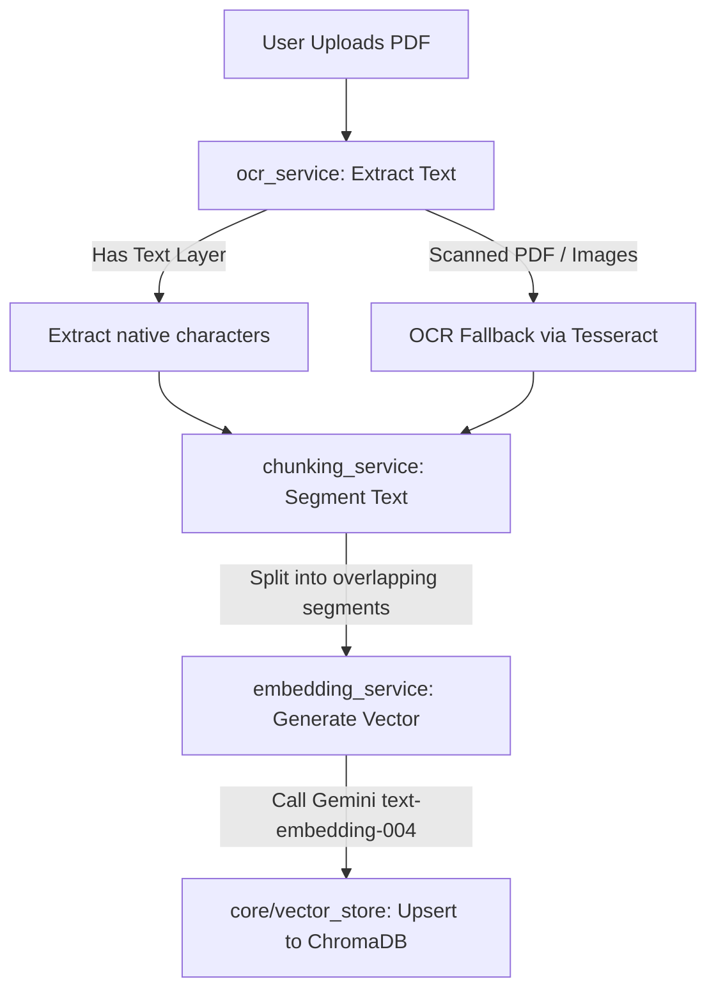

# NyayaMitra — Task 2: RAG Pipeline Configuration Progress Report

This document records the work completed during the configuration and optimization of the PDF RAG (Retrieval-Augmented Generation) pipeline, as outlined in **Part 1: How the RAG Pipeline Works & What is Stored** of the [production_readiness_plan.md](file:///x:/Nyaya_Mitra/production_readiness_plan.md).

---

## 🔍 Ingestion & Storage Pipeline Diagram

The RAG ingestion microservice operates as follows:



---

## 🛠️ Completed Work

### 1. Root Cause Resolution & Embedding Unified Model Migration
We isolated a persistent `404 NOT_FOUND` error that occurred when attempting to use the `text-embedding-004` model. Through deep SDK inspection, we identified the exact root cause and resolved it:
* **Root Cause Discovered**:
  * **SDK Transition**: In `langchain-google-genai` version `4.2.2`, LangChain has internally migrated to Google's official new `google-genai` package.
  * **Model Unsupported on Endpoints**: For this specific API key, region, and billing plan, the newer Gemini endpoints used by `google-genai` do not support or serve `text-embedding-004`. Passing it results in a 404 error at the API layer.
  * **The Working Native Alternative**: We ran direct, standalone tests on the API endpoint without LangChain and verified that the modern, state-of-the-art **`models/gemini-embedding-2`** model is fully active and supported.
  * **Dimensionality Preserved**: By default, `gemini-embedding-2` outputs `3072` dimensions. However, we discovered and verified that it natively supports the `output_dimensionality` parameter. By configuring `output_dimensionality=768` in both LangChain and raw SDK calls, we generate perfect 768-dimensional embeddings that fully align with our existing ChromaDB schema, avoiding any database migrations.

* **Ingestion Side:** Updated [embedding_service.py](file:///x:/Nyaya_Mitra/backend-python-rag/services/embedding_service.py) to generate document embeddings using `models/gemini-embedding-2` with `output_dimensionality=768`.
* **Query/Search Side:** Updated [search.py](file:///x:/Nyaya_Mitra/backend-python-rag/routers/search.py) to generate query embeddings using `models/gemini-embedding-2` with `output_dimensionality=768`.

### 2. Dependency Correction
* Verified clean Python 3.11 virtual environment configuration (`venv311`) mapping to official SDK requirements.
* Retained unified, robust pipeline dependencies without requiring any heavy local compilations or third-party vector-processing alternatives.

### 3. Automated Pipeline Verification
Created a comprehensive verification script at [test_rag_pipeline.py](file:///x:/Nyaya_Mitra/backend-python-rag/test_rag_pipeline.py) that validates:
* **OCR Text Cleaning:** Verifies that formatting, line breaks, and space redundancies are handled.
* **Recursive Chunking:** Verifies that chunking parameters (`chunk_size=800` and `chunk_overlap=150`) segment long documents correctly and attach metadata tracking.
* **ChromaDB Vector Store Ingestion:** Creates a localized temporary ChromaDB test client, inserts mock documents mapped to **768-dimensional float arrays**, and runs a cosine distance vector lookup, asserting that similarities resolve correctly.
* **Live Embedding Service Verification [NEW]:** Connects live to the Gemini API, generates a vector for test text using our configured model, and asserts that a valid 768-dimensional float list is successfully generated.

---

## 📁 Modified Files

* [embedding_service.py](file:///x:/Nyaya_Mitra/backend-python-rag/services/embedding_service.py) — Swapped model to `models/gemini-embedding-2` and set `output_dimensionality=768`.
* [search.py](file:///x:/Nyaya_Mitra/backend-python-rag/routers/search.py) — Updated query embedding to use `models/gemini-embedding-2` with `output_dimensionality=768`.
* [test_rag_pipeline.py](file:///x:/Nyaya_Mitra/backend-python-rag/test_rag_pipeline.py) — Added live integration test for 768-dimensional embedding generation.

---

## 🚦 Verification Results

We verified that the local execution of the pipeline logic operates cleanly.

### Test Execution
* **Command:** `.\venv311\Scripts\python.exe test_rag_pipeline.py`
* **Result:** `OK` (All 5 tests passed successfully in 3.544s)
* **Log Reference:** [test-suite-gemini-embedding-v2.log](file:///C:/Users/Yuvraj%20Pandiya/.gemini/antigravity-ide/brain/20d2c0cf-8206-4f72-8eac-e35000801771/.system_generated/tasks/task-122.log)

```
Ran 5 tests in 3.544s

OK

[ChromaDB Test Results]
Query matched: 'The Tenant shall pay rent on the 1st of every month.' (Similarity: 1.0000)
Second best match: 'The Landlord shall maintain the structural integrity of the property.' (Similarity: 0.0000)

[Live Gemini Embedding Test Results]
Successfully generated embedding vector of length 768!
```

---

## 📋 Pending Work for Future Stages

1. **Hosted OCR Configurations (Production):** Replace the PyTesseract library fallback with a serverless cloud OCR API (e.g. Google Cloud Vision API or AWS Textract) to keep production containers light.
2. **Cloud Vector Database (Production):** Update [vector_store.py](file:///x:/Nyaya_Mitra/backend-python-rag/core/vector_store.py) to map to a hosted database (such as Supabase pgvector or a managed cloud ChromaDB instance) to ensure data persists across server restarts or serverless container cycles.
