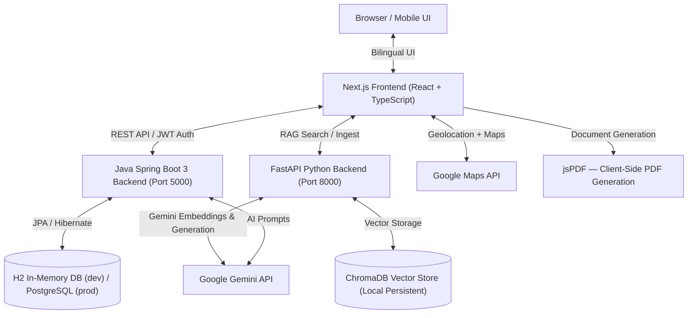
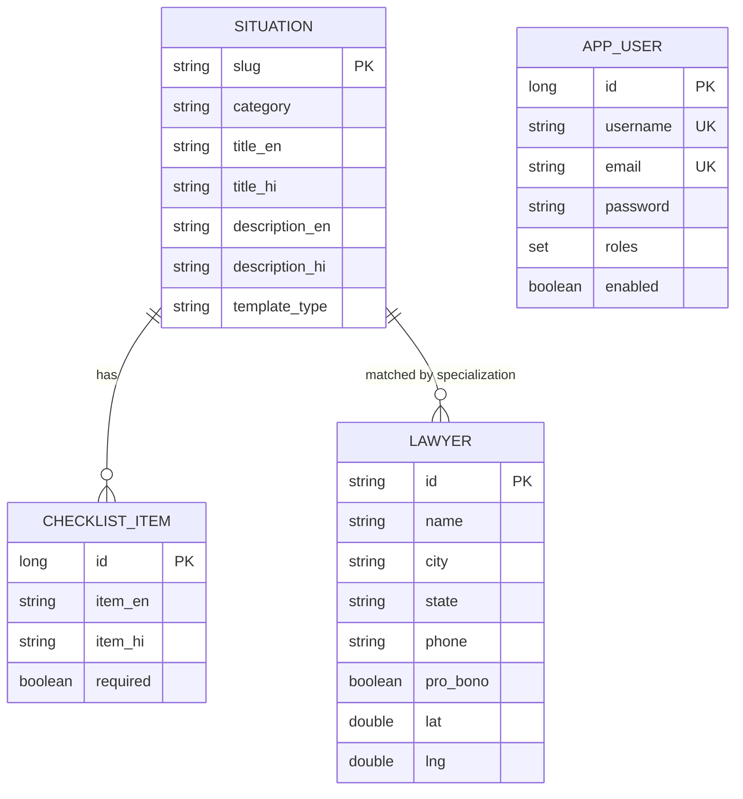

# NyayaMitra — AI-Enhanced Legal Aid Platform for First-Generation Litigants

**Live Working Demo Link:** https://project-legal-o8gx.vercel.app/

**Screenshots / Screen Recording:**

Video Link - https://drive.google.com/file/d/16jZc6bzrzVmW7RAoTZ9VGD_YB8O0mVpA/view?usp=sharing
---

## 👥 Team Details

**Project Title:** NyayaMitra — AI-Enhanced Legal Aid Platform for First-Generation Litigants  
**Team Name:** Team Fusion Optimizer
**Team Members:**
- Swayam Garg
- Yuvraj Pandiya
- Ajay Sahani
- Nikhil Singh Rajput

---

## 🎯 Problem Statement (WD-04)

India has over **45 million pending court cases**, leaving first-generation litigants overwhelmed by legal jargon and complex procedures. **NyayaMitra** bridges this gap by providing a guided, bilingual (Hindi + English) legal aid experience.

When a user selects a life situation (e.g. Landlord Dispute, Consumer Complaint, FIR Filing), the platform:

1. **Explains Legal Rights** in plain language using Google Gemini AI, alongside the actual law text.
2. Generates an interactive **Document Checklist** and **Step-by-Step Procedure**.
3. Shows a **Map-Based Legal Aid Directory** of nearby pro bono lawyers and NALSA clinics.
4. Produces a **Filled-In Legal Document** (RTI, FIR Draft, Consumer Complaint) as a downloadable PDF.

---

## 🏗 Architecture

### System Diagram



### 2. System Workflow / User Flow

*Eraser Prompt for diagram generation:*<br/>


### Request Flow

```text
User → Situation Selector → Rights Explainer (Gemini AI)
     → Step-by-Step Procedure → Document Checklist
     → [Generate PDF Document] OR [Find Pro Bono Lawyer on Map]
     
User/Lawyer → Knowledge Base PDF Ingest → OCR/Extract → Chunk → Embed (Gemini) → ChromaDB
User → Chatbot Query → RAG Search → Retrieve Chroma Context → Generate Answer (Gemini)
```

---

## 📁 Folder Structure

```text
hackathon3/
├── backend-java/                      # ✅ ACTIVE BACKEND — Spring Boot 3 / Java 21
│   ├── src/main/java/com/nyayamitra/
│   │   ├── controller/                # REST Controllers (AI, Auth, Lawyers, Situations)
│   │   ├── service/                   # Business logic (AiService, AuthService, ...)
│   │   ├── entity/                    # JPA Entities (Situation, Lawyer, AppUser, ...)
│   │   ├── repository/                # Spring Data JPA Repositories
│   │   ├── dto/                       # Request / Response DTOs
│   │   ├── security/                  # JWT filter, JwtUtils, SecurityConfig
│   │   ├── config/                    # CORS, Swagger / OpenAPI config
│   │   └── exception/                 # Global exception handler
│   ├── src/main/resources/
│   │   ├── application.yml            # Server config (port, DB, JWT, Gemini)
│   │   └── data/                      # Seed JSON data (situations, lawyers)
│   └── pom.xml                        # Maven build — Spring Boot 3.2.5, Java 21
│
├── backend-python-rag/                # ✅ RAG PIPELINE BACKEND — FastAPI / Python 3
│   ├── core/                          # ChromaDB Vector Store client setup
│   ├── routers/                       # Ingest & Search API routes
│   ├── services/                      # OCR extraction, Chunking, Embeddings, Generation
│   ├── main.py                        # FastAPI Server Entrypoint
│   ├── requirements.txt               # Python package dependencies
│   └── .env                           # Environment configuration (Gemini API keys, Host/Port)
│
└── frontend/                          # Next.js App
    ├── app/                           # App Router pages
    │   ├── page.tsx                   # Home / Landing
    │   ├── situations/                # Situation list + detail pages
    │   ├── generate/[slug]/           # Document generation wizard
    │   ├── lawyers/                   # Pro bono lawyer map
    │   ├── knowledge-base/            # RAG Knowledge Base PDF uploader
    │   └── about/                     # About page
    ├── components/                    # Reusable UI components
    ├── data/                          # Static situation JSON (client-side fallback)
    ├── lib/
    │   └── pdfGenerator.ts            # jsPDF — RTI, FIR, Consumer Complaint, Checklist
    ├── types/index.ts                 # Shared TypeScript interfaces (DocumentFormData, ...)
    └── locales/                       # i18next dictionaries (en, hi)
```

---

## ⚙️ Setup & Installation

### Prerequisites

| Requirement | Version |
|---|---|
| **Java (JDK)** | 21+ |
| **Maven** | Bundled via `mvnw` wrapper |
| **Node.js** | 18+ |
| **npm** | 9+ |

---

### Step 1 — Clone the Repository

```bash
git clone https://github.com/Swayam7Garg/Project_Legal.git
cd Project_Legal
```

---

### Step 2 — Backend Setup (Java Spring Boot)

```bash
cd backend-java

# Windows
mvnw.cmd spring-boot:run

# macOS / Linux
./mvnw spring-boot:run
```

> The backend starts on **http://localhost:5000**  
> H2 Console (dev): **http://localhost:5000/h2-console**  
> Swagger UI: **http://localhost:5000/swagger-ui.html**  
> API Docs: **http://localhost:5000/api-docs**

### Step 3 — Python RAG Backend Setup

```bash
cd backend-python-rag

# Install dependencies
pip install -r requirements.txt

# Start the server
python main.py
```

> The Python RAG backend starts on **http://localhost:8000**
> Uses local persistent ChromaDB inside `data/chromadb/` — no Docker daemon required!

---

### Step 4 — Frontend Setup

```bash
cd ../frontend
npm install
npm run dev
```

> Frontend runs on **http://localhost:3000**

---

## 🔑 Environment Variables

### `backend-java/.env` (or as OS env vars)

| Variable | Default (dev) | Description |
|---|---|---|
| `DB_URL` | `jdbc:h2:mem:nyayamitra` | JDBC URL — falls back to H2 if postgres is commented out |
| `DB_USERNAME` | `sa` | Database username |
| `DB_PASSWORD` | *(empty)* | Database password |
| `DB_DRIVER` | `org.h2.Driver` | Database driver |
| `JWT_SECRET` | *(dev key)* | JWT secret key |
| `GEMINI_API_KEY` | *(dev key)* | Google Gemini API key |

### `backend-python-rag/.env`

| Variable | Default (dev) | Description |
|---|---|---|
| `GOOGLE_API_KEY` | *(dev key)* | Google Gemini API key (for LangChain & Embeddings) |
| `GEMINI_API_KEY` | *(dev key)* | Google Gemini API key |
| `HOST` | `0.0.0.0` | Server host address |
| `PORT` | `8000` | Server port |

### `frontend/.env.local`

```env
NEXT_PUBLIC_BACKEND_URL=http://localhost:5000
NEXT_PUBLIC_GOOGLE_MAPS_API_KEY=your_google_maps_key_here
```

---

## 🌐 API Endpoints

### 1. Java Backend (Port 5000)
All endpoints are documented interactively at **http://localhost:5000/swagger-ui.html**.

| Method | Path | Description | Auth |
|---|---|---|---|
| `GET` | `/api/situations` | List all legal situations (summary) | Public |
| `GET` | `/api/situations/{id}` | Full situation detail by slug | Public |
| `GET` | `/api/lawyers` | Search pro-bono lawyers (`?city=&state=&specialization=`) | Public |
| `GET` | `/api/lawyers/city/{city}` | All lawyers in a city | Public |
| `POST` | `/api/ai/explain-rights` | Gemini AI — explain rights for a situation | Public |
| `POST` | `/api/ai/analyze-case` | Gemini AI — analyze user's legal position | Public |
| `POST` | `/api/ai/chat` | Gemini AI — multi-turn legal chatbot | Public |
| `POST` | `/api/ai/translate-document` | Gemini AI — simplify legal document text | Public |
| `POST` | `/api/auth/register` | Register a new user (returns JWT) | Public |
| `POST` | `/api/auth/login` | Login (returns JWT) | Public |
| `GET` | `/api/health` | Health check | Public |

### 2. Python RAG Backend (Port 8000)

| Method | Path | Description | Auth |
|---|---|---|---|
| `POST` | `/ingest` | Upload a PDF, extract, chunk, embed, and store in ChromaDB | Public |
| `GET` | `/ingest/stats` | Get the total number of document chunks currently indexed | Public |
| `POST` | `/search` | Retrieve context from ChromaDB, merge history, and generate answer | Public |

---

## 🗄 Database Schema



---

## 🔐 Security & Auth

- **Spring Security + JWT** (JJWT 0.12.5) protects admin-level routes.
- All core public-good features (situations, lawyers, AI, PDF generation) are **publicly accessible** — no login required — to maximize reach for marginalized communities.
- The `ROLE_ADMIN` role is reserved for future content administration (updating lawyers, situations).
- JWT tokens expire after **24 hours** (configurable via `jwt.expiration-ms`).

---

## 📝 Sample Test Inputs

### AI Document Simplification (`POST /api/ai/translate-document`)
```json
{
  "documentText": "Whoever, being in any manner entrusted with property, dishonestly misappropriates or converts to his own use that property, commits criminal breach of trust. (IPC Section 405)",
  "lang": "en"
}
```

### Legal Chatbot (`POST /api/ai/chat`)
```json
{
  "situationId": "landlord-dispute",
  "messages": [
    { "role": "user", "content": "My landlord is refusing to return my security deposit of ₹20,000. What are my rights?" }
  ],
  "lang": "hi"
}
```

### Lawyer Search
```
GET http://localhost:5000/api/lawyers?city=Indore&specialization=Consumer%20Rights
```

---

## 🤖 AI & Ethics Declaration

### AI Usage
- **Google Gemini 1.5 Flash** — Used via direct REST calls (`RestTemplate`) for:
  - Legal rights explanation in plain Hindi/English
  - Multi-turn legal chatbot
  - Legal document simplification
- **GitHub Copilot / AI Assistants** — Used for boilerplate generation, debugging, and refactoring during development.
- **Strict Prompt Constraints:** System instructions ensure the LLM never halluccinates laws, targets an 8th-grade reading level, and always declares: *"This is legal information, not legal advice."*

### Data Sources
- **Real Legal Sources:** Laws, rights, and NALSA structures are referenced from [IndiaCode](https://indiacode.nic.in) and [NALSA](https://nalsa.gov.in).
- **Synthetic Data:** Lawyer directory entries (specifically Indore, MP names/numbers) use synthetic data for safe demo testing. Delhi entries map to real public NALSA addresses.

---

## 🏆 Domain-Specific Highlights (WD-04 Criteria)

| Criterion | Implementation |
|---|---|
| **Bilingual Support** | Full Hindi + English UI via `react-i18next`; all AI responses also bilingual |
| **Legal Document Generation** | Client-side jsPDF — RTI, FIR Draft, Consumer Complaint, Labour Rights |
| **Role-Based Access** | Public for all core features; JWT-protected for future admin role |
| **Map Integration** | `@react-google-maps/api` with lawyer markers and proximity filters |
| **Database** | H2 (dev) / PostgreSQL (prod) via Spring Data JPA |
| **Swagger / OpenAPI** | Full API documentation at `/swagger-ui.html` |
