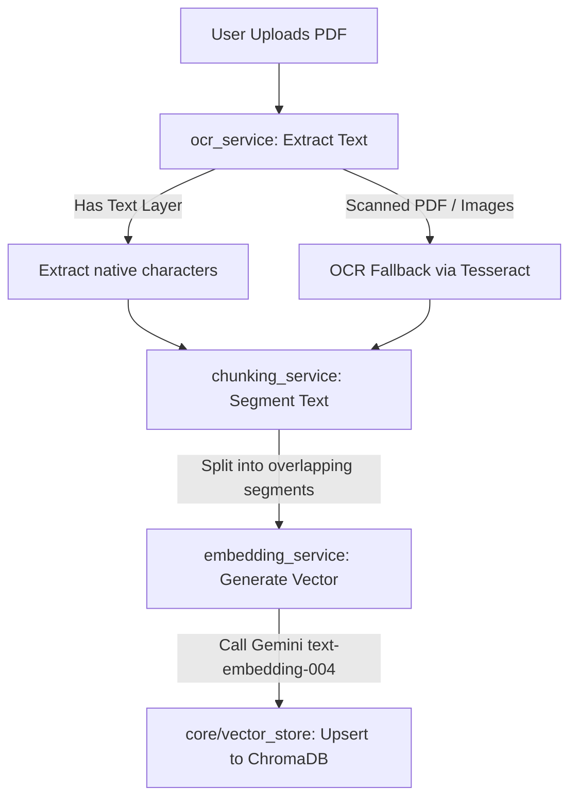

# NyayaMitra — Production Readiness Plan & RAG Deep Dive

This document details how the PDF RAG (Retrieval-Augmented Generation) pipeline operates, how database persistence works, and what tasks remain to prepare the application for a production release.

---

## 🔍 Part 1: How the RAG Pipeline Works & What is Stored

When you upload a PDF through the Knowledge Base interface, the FastAPI Python backend (`backend-python-rag`) runs it through the ingestion pipeline:

### What is Stored in the Vector Database?
For every extracted text segment (chunk), the local persistent database stores:

| Field | Data Type | Description | Example / Format |
|---|---|---|---|
| **ID** | `String` | Unique identifier generated per chunk to prevent duplicates on re-upload | `"[filename]_chunk_[index]"` |
| **Document** | `String` | The actual raw text content of that chunk | `"The Tenant shall pay rent on the 1st of..."` |
| **Embedding** | `Array[Float]` | A 768-dimensional vector representation of the semantic meaning | `[0.0125, -0.0482, 0.9841, ...]` |
| **Metadata** | `JSON` | Accompanying context details for source tracking | `{"filename": "rent_agreement.pdf", "chunk_index": 0, "char_count": 850}` |

---

## 💾 Part 2: Will My Uploaded Data Remain in Production?

### ⚠️ The Current Status (Local Dev)
Right now, both backends use local storage:
1. **Java Backend:** Uses **H2 In-Memory Database**. All users, situations, and lawyers are stored in RAM. **When you restart the Java backend, this data resets and seeds fresh from JSON files.**
2. **Python Backend:** Uses **ChromaDB Local Persistent Storage** (saved inside `backend-python-rag/data/chromadb`). The documents you upload **will persist** on your local machine across Python server restarts.

### 🌐 The Production Reality
If you deploy this application to cloud hosting platforms:
* **Java Backend:** Must be switched to a permanent database (e.g. **Supabase PostgreSQL**). Otherwise, users' registrations and data will be lost on every deployment or server restart.
* **Python Backend:** Serverless hosting (like Vercel, Render, or AWS Lambda) uses **ephemeral (temporary) file systems**. This means any files written to `data/chromadb` will be **deleted** when the container sleeps or restarts.
* **The Solution:** For production, you must use a hosted vector database.
  * **Option A (Recommended): pgvector in Supabase.** Since you already have a Supabase Postgres database, you can enable `pgvector` and store your document embeddings directly alongside user data in PostgreSQL.
  * **Option B: Managed Vector Host.** Store your embeddings on a free tier of a managed vector service (like Pinecone, Qdrant, or Chroma Cloud).

---

## 🗺️ Part 3: Production Readiness Checklist

To transition **NyayaMitra** from a local hackathon prototype to a secure, stable production application, the following issues must be resolved:

### 1. Database Migration (Java)
* Move the Spring Boot datasource from H2 to PostgreSQL by restoring the `.env` settings in `backend-java`.
* Implement a database migration tool like **Flyway** or **Liquibase** to manage schemas and seed the initial production records automatically instead of relying on Java application-start seeder logs.

### 2. Vector DB Migration (Python)
* Update `backend-python-rag/core/vector_store.py` to point to a cloud-based vector store (managed Chroma instance, Pinecone, or Supabase pgvector) rather than a local sqlite file.

### 3. Hosted OCR Configuration
* The uploader currently relies on PyTesseract. In a cloud environment, you must install the Tesseract system binaries on the container.
* To make deployments lightweight, switch `ocr_service.py` to use a cloud API (like **Google Cloud Vision API**, **AWS Textract**, or **OCR.space**) for scanning PDFs.

### 4. JWT Authentication Polish
* Right now, the JWT token lasts 24 hours. For security, implement **Refresh Tokens** stored in HTTP-Only cookies to protect against token hijacking.

### 5. CORS Policies Whitelisting
* In [backend-java/src/main/resources/application.yml](file:///c:/Users/swaya/OneDrive/Desktop/hackathon3/backend-java/src/main/resources/application.yml) and `backend-python-rag/main.py`, replace `allowed-origins: http://localhost:3000` with the actual production domain where the frontend is hosted (e.g. Vercel URL).

### 6. Centralized Logging & Error Tracking
* Set up an APM tool (like **Sentry** or **Loggly**) on both backends to capture LLM API errors or database connection drops.
